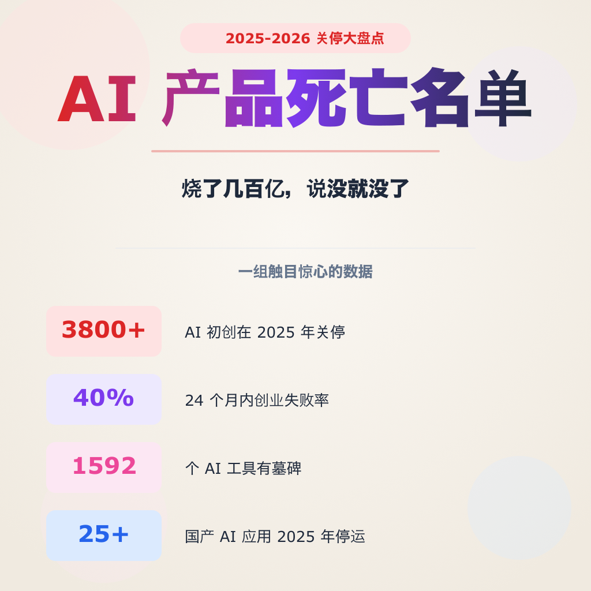

# AI产品死亡名单 — 2025-2026年关停的AI产品

> 小红书风格文章 · 2026-06-03
> 烧了几百亿，说没就没了

---

## 📖 正文

### 2025-2026，AI行业最大关停潮

不是所有AI产品都能活下来。

据AI Graveyard统计，截至2026年5月，全球已有超过168个知名AI工具关停或被收购，仅2026年就有55个。另一数据显示Dang.ai的AI Graveyard已收录1,592个"阵亡"AI工具，占收录总数的近30%。

国内同样惨烈——2025年至少25个知名国产AI应用相继停运，涵盖字节跳动、阿里巴巴、腾讯、美团、小红书、科大讯飞等大厂项目，以及阶跃星辰、智谱、MiniMax等明星创业公司的创新尝试。

我整理了最值得关注的10个AI产品关停案例。

---

### 全球篇

#### 1️⃣ OpenAI Sora — 2026年3月关停

AI视频生成的开创者，2024年初首次亮相震惊科技界。2025年9月正式上线独立App，五天下载破百万，一度登顶App Store免费榜。

然后急速坠落。

据TechCrunch，截至2026年1月，Sora下载量暴跌45%。整个生命周期内消费者总收入累计仅约140万美元，最好的单月也不过54万美元。但日运营成本估算高达1500万美元，年运营成本约55亿美元。

更戏剧的是，关停前三个月OpenAI刚和迪士尼签了三年10亿美元合作协议，授权200+IP角色。迪士尼的钱还没打，产品先没了。

2026年3月25日，奥特曼宣布逐步关停所有视频产品。

#### 2️⃣ Humane AI Pin — 2025年2月关停

融资2.3亿美元，2018年创立，目标是"杀死智能手机"。

结果：
- 上市10天，差评如潮
- 充电盒起火召回
- 远程锁机，699美元变废铁
- 卖身HP仅1.16亿美元

从天使到尸体，6年烧光2.3亿。

#### 3️⃣ Builder.ai — 2025年倒闭

微软背书的AI独角兽，融资4.45亿美元，估值15亿美元。号称"AI驱动无代码编程"。

真相：
- 所谓的"AI编程"其实是印度外包
- 数百名人类开发者在幕后干活
- 审计发现2023-2024收入虚报75%
- 贷款方直接端走3700万美元现金
- 2025年中进入破产

#### 4️⃣ Rabbit R1 — 2025年底死亡

2024年CES爆火的AI硬件，融资3000万美元。号称"AI助理"。

产品上线后，评论称"不好用、未完成、无帮助的AI玩具"。基本任务都处理不好。到2025年底，员工数月没发工资，公司严重财务困难。网站还在打折卖R1——但公司已经是行走的尸体。

#### 5️⃣ Inflection AI (Pi) — 2024-2025年被掏空

融资15亿美元的AI陪伴明星产品。

2024年3月，微软直接"吸收"了几乎整个公司。联合创始人Mustafa Suleyman和Karen Simonyan带着大部分工程团队跳槽微软AI部门。留下的空壳从陪伴产品转型企业API，完全变了家公司。

#### 6️⃣ Stability AI — 2025年严重萎缩

开源Stable Diffusion的明星公司。CEO 2024年3月辞职，裁员10%，版权诉讼堆积，核心研究员陆续离开。到2025年，虽是"技术上还活着"，但已是曾经的影子。

---

### 中国篇

#### 7️⃣ 冒泡鸭 — 2025年11月关停

阶跃星辰出品的AI陪伴应用，2024年4月上线，全平台下载量突破600万次，曾是AI情感陪伴标杆。但随着公司战略转向通用对话产品"跃问"，团队合并，产品停运。

关停公告中明确提及"监管原因"。

#### 8️⃣ 鹿班（阿里）— 2025年6月停服

原名"鲁班"，2015年诞生，电商AI设计平台。曾在双11支撑亿级海报和主图生成，被称为"美工终结者"。2018年对外开放。

随着阿里云战略收缩，2024年暂停新购与续费，2025年6月30日全面停服。后来阿里转而与美图合作AI电商工具。

#### 9️⃣ 腾讯智影 — 2025年6月停服

2023年3月发布的云端智能视频创作工具，主打数字人功能。经历2023年"数字人播报"热潮后，2025年4月宣布业务调整，6月30日清空用户数据。公众号已注销。

#### 🔟 字节小悟空 — 2025年整合下架

原为"悟空搜索"，2023年改名定位为多功能AI工具平台，集成200多个AI工具。全平台下载量接近200万次。去年各大应用市场陆续下架，内容并入今日头条。

---

### 其他关停产品一览

| 产品 | 公司 | 关停时间 | 原因 |
|------|------|---------|------|
| XEVA | 小冰 | 2025.11 | 监管+战略调整 |
| 异世界回响 | Soul | 2025下半年 | 监管 |
| 腾讯翻译君 | 腾讯 | 2025.3 | 迁移至腾讯元宝 |
| 讯飞写作 | 科大讯飞 | 2025.11 | 用户量不足13万 |
| 奇域AI | 小红书 | 2025.6 | 版权诉讼+整合 |
| Wow AI | 美团 | 2025.12 | 关服 |
| Lumi噜米 | 禹幻科技 | 2025.9 | 监管 |
| 筑梦岛 | 阅文/商汤 | 2025 | 监管约谈 |
| 百度脑图 | 百度 | 2026.3 | 被AI替代 |
| 胃之书 | 独立开发者 | 2025 | 创始人转项目 |

---

### 三个血泪教训

**1. 没有护城河的薄包装，死得最快**

AI写作、AI邮件、AI图像——这些套壳调用大模型API的产品在墓地里密密麻麻。GPT-4加文件上传，死一批PDF对话工具；ChatGPT加自定义指令，死一批Prompt管理工具。你的功能是大模型的子集，大模型迭代一次，你的存在理由就少一分。

**2. 商业化失败是最普遍的死因**

大多数AI应用在"免费获客→烧钱运营→无法变现"的循环中耗尽。陪伴类AI尤其惨——流量高、留存低、转化更低。2025年AI陪伴类应用集体阵亡，至少8个知名产品关停。

**3. 大厂收缩时，边缘AI产品最先被砍**

腾讯智影、字节小悟空、阿里鹿班——这些大厂"试水"产品，在资源收紧时首当其冲。字节关停十余款应用，百度清理工具产品，OpenAI砍掉Sora。做减法正在取代做加法成为主旋律。

---

### 什么产品活下来了？

| 赛道 | 幸存者 |
|------|--------|
| AI编程 | Cursor, GitHub Copilot, Windsurf |
| AI聊天 | ChatGPT, Claude, Gemini |
| AI搜索 | Perplexity |
| AI创意 | Midjourney, Adobe Firefly |
| AI写作 | Notion AI, Grammarly |

它们的共同点：不是薄包装，不是单点工具，而是深入嵌入用户工作流的产品。

---

## 📂 文件清单

| 文件 | 说明 |
|------|------|
| `article.md` | 小红书发布草稿 |
| `README.md` | 本文 |
| `ai-graveyard-cover.png` | Cover card (1024×1024) |
| `gen_cards.py` | SVG generator |
| `*.svg` | Card sources |
| `*.png` | Card outputs |

## 📝 数据来源
- [AI Graveyard (ToolDirectory.AI)](https://tooldirectory.ai/ai-graveyard)
- [AI Graveyard (aigraveyard.org)](https://www.aigraveyard.org/)
- [The AI Tool Graveyard — AI Agent Brief](https://www.ai-agent-brief.com/ai-tool-hub/ai-tool-reports/the-ai-tool-graveyard-products-that-shut-down-or-pivoted-in-2025%E2%80%932026.html)
- [36氪 — 大厂也没能幸免，25款AI应用集体"猝死"](https://36kr.com/p/3629248129958920)
- [虎嗅 — 2025年AI硬件死亡名单](https://www.huxiu.com/article/4838294.html)
- [腾讯新闻 — OpenAI关停Sora始末](https://news.qq.com/rain/a/20260326A02K7Y00)
- [Bet on AI — AI Tools Hyped in 2025 But Dead by 2026](https://betonai.net/ai-tools-hyped-2025-dead-2026-saas-casualties/)
