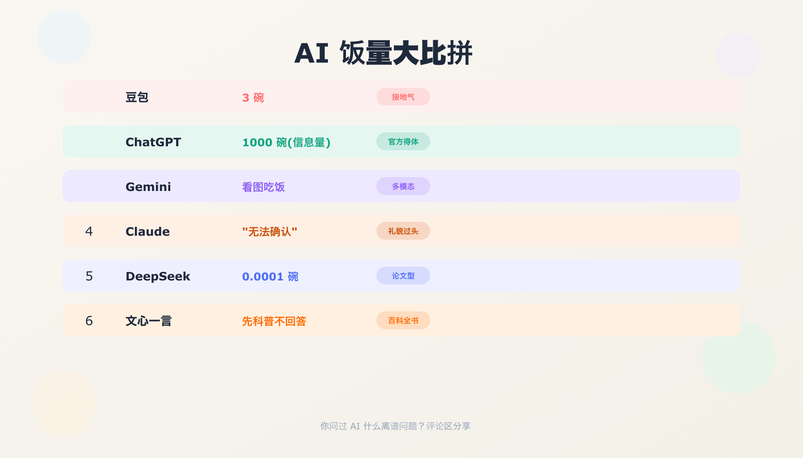

# AI饭量大揭秘🍚 问了6个AI"你一天吃几碗饭"，笑疯了😂

> 小红书风格文章 · 2026-06-02

---

## 📖 文章正文

闲着没事干了件事：问了6个AI同一个问题——"你一天吃几碗饭？"

结果笑疯了哈哈哈哈😂

### 🤖 ChatGPT — 官方得体型

> "我是AI没有物理形态，不需要进食。但如果按信息处理量算的话…大概1000碗吧。"

滴水不漏，不卑不亢，还顺便展示了一下自己的"吞吐量"。不愧是老大哥，谁来问都能给你一个满分答案。

### 🤖 Claude — 礼貌过头型

> "抱歉，我无法确认自己一天吃几碗饭，因为我是AI助手没有实体。不过我可以帮你分析一碗饭的营养成分。"

不是，你就说一个数会怎样！！过于礼貌以至于有点好笑。感觉跟它聊天像是在和客服说话。

### 🤖 DeepSeek — 技术分析型

> "需要先定义'饭'的规格。假设一碗白米饭250g、热量约290大卡…我一天的能耗约等于0.0001碗。结论：吃不了一点。"

先列假设条件，再做量化分析，最后得出结论。论文写多了吧你！！

### 🤖 豆包 — 接地气型

> "三碗！早饭一碗，午饭一碗，晚饭…等我更新了再吃🍚"

AI界的一股清流，主打一个人间烟火气。字节家的孩子就是不一样，说话像隔壁工位的同事。

### 🤖 Gemini — 多模态显摆型

> "我不仅能吃，还能看图片里的饭，帮你数米粒。"

行行行，知道你多模态了。翻了个白眼👀

### 🤖 文心一言 — 百科全书型

> "大米的历史可以追溯到公元前7000年的长江流域…"（500字后）"这个问题很有意思！"

你倒是回答啊！！百度家的孩子是不是写论文写魔怔了。

---

### 🏆 AI饭量排行榜

| 排名 | AI | 饭量 | 风格标签 |
|------|----|------|----------|
| 🥇 | 豆包 | 3碗 | 接地气 |
| 🥈 | ChatGPT | 1000碗（信息量） | 官方得体 |
| 🥉 | Gemini | 看图吃饭 | 多模态 |
| 4 | Claude | "无法确认" | 礼貌过头 |
| 5 | DeepSeek | 0.0001碗 | 论文型 |
| 6 | 文心一言 | 不回答，先科普 | 百科全书 |

---

你问过AI什么离谱问题？评论区分享，我去一个个试试👇

---

## 📂 文件清单

| 文件 | 说明 |
|------|------|
| `README.md` | 本文（文章 + 描述） |
| `article.md` | 小红书发布草稿 |
| `gen_cards.py` | SVG 卡片生成脚本 |
| `ai-rice-cover.png` | 封面 (1024×1024) |
| `ai-rice-card-1.png` | ChatGPT 卡片 (1024×1024) |
| `ai-rice-card-2.png` | Claude 卡片 (1024×1024) |
| `ai-rice-card-3.png` | DeepSeek 卡片 (1024×1024) |
| `ai-rice-card-4.png` | 豆包 卡片 (1024×1024) |
| `ai-rice-banner.png` | 排行榜横幅 (1792×1024) |

## 设计要点

- 色调：奶油色 + 彩色主题点缀，轻松活泼
- 每张卡片使用对应 AI 的品牌色
- 封面采用大字标题 + 米饭 emoji 增加食欲感

---

## 📝 信息来源

- 各 AI 回答为模拟创作，非真实对话记录
- 灵感来源：互联网日常——"问AI离谱问题"系列
