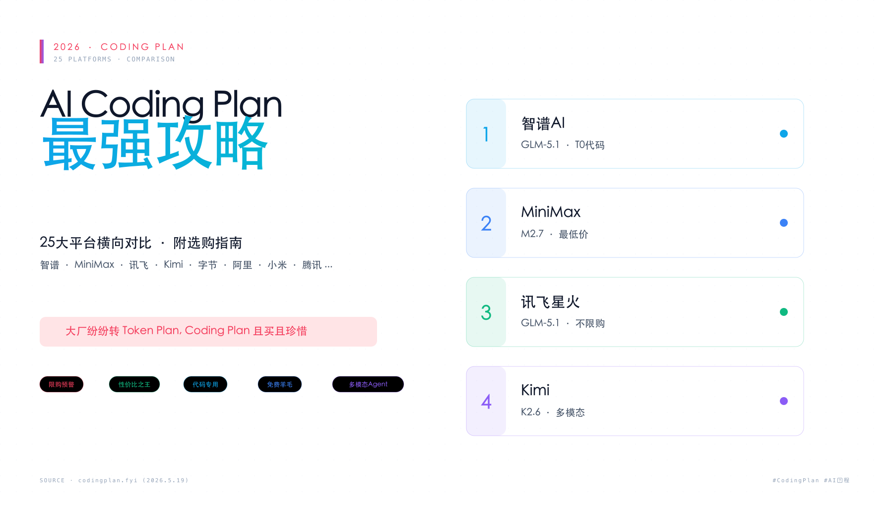
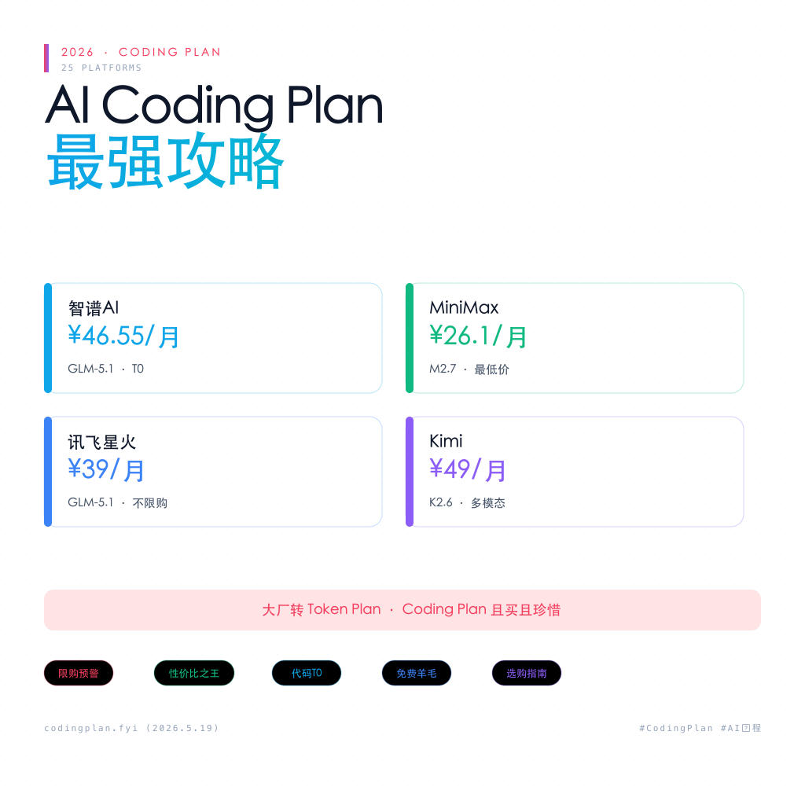

# 2026国内AI Coding Plan最强攻略来了!

> 小红书风格文章 · 2026-06-02 · 正文 ~950 字
> 来源: codingplan.fyi · 25大平台对比

---

## 📖 文章正文

姐妹们!2026 AI编程套餐对比大全来啦～码住这篇就够了!👇

📢 大新闻:阿里/字节/腾讯都在改Token Plan,Coding Plan且买且珍惜!

---

### 🥇 第一梯队

**1️⃣ 智谱AI ⭐⭐⭐⭐⭐**
- 独占GLM-5.1,代码能力T0级别,Opus平替
- Lite首月¥46.55,月24,000次请求
- ⚠️ 每日10:00限量抢购,1分钟售罄

**2️⃣ MiniMax ⭐⭐⭐⭐⭐**
- 全平台最低价!Starter首月仅¥26.1
- 独占M2.7模型,不限购不限频
- 极速版TPS达100,养龙虾首选

**3️⃣ 讯飞·星火 ⭐⭐⭐⭐⭐**
- 无需抢购!39元/月用GLM-5.1
- 量比字节方舟还足,智谱平替最优选

**4️⃣ Kimi ⭐⭐⭐⭐**
- 支持K2.6+多模态,能看图写前端
- Andante版¥49/月,Agent 4倍速
- ⚠️ 用量未公开,推测偏少

---

### 🔥 限购预警!

| 平台 | 状态 | 月费起 | 推荐人群 |
|------|------|--------|----------|
| **智谱AI** | ⚠️限购!抢 | ¥46.55 | 代码质量党 |
| **MiniMax** | ✅不限购 | ¥26.1 | 性价比党 |
| **讯飞·星火** | ✅不限购 | ¥39 | 不想抢的 |
| **Kimi** | ✅不限购 | ¥49 | 多模态党 |
| **字节·方舟** | ⚠️已限购 | ¥36 | 多模型党 |
| **阿里·百炼** | ⚠️仅Pro | ¥200 | 长上下文党 |

---

### 💰 选型建议

- **代码最强**:智谱AI(能抢到的话)
- **性价比王**:MiniMax Starter(¥26.1真香)
- **不用抢用GLM-5.1**:讯飞·星火
- **多模态/Agent**:Kimi
- **学生党**:GitHub Copilot学生版免费用

---

### 🆓 免费羊毛

- **小米MiMo**:可领16亿Credits
- **NVIDIA NIM**:每分钟40次,无Token限制
- **摩尔线程**:新用户30天免费
- **商汤·日日新**:每5小时1500次

---

### ⚠️ 重要提醒

> 2026趋势:大厂都在转Token Plan,Coding Plan越来越稀缺。已经限购了智谱/字节/阿里,腾讯已全面下架。且买且珍惜!

**数据来源:codingplan.fyi(2026.5.19更新)**

你用的是哪个平台?评论区聊聊👇

`#AI编程` `#CodingPlan` `#智谱AI` `#Kimi` `#MiniMax` `#编程工具` `#AI工具推荐`

---

## 📂 文件清单

| 文件 | 说明 |
|------|------|
| `README.md` | 本文(文章+描述) |
| `coding-plan-banner.png` | 横版配图 (1792×1024),适合微博/头图 |
| `coding-plan-square.png` | 方版配图 (1024×1024),适合小红书封面 |

## 📝 信息来源

- [codingplan.fyi](https://www.codingplan.fyi/)
- 25大平台:Coding Plan / Agent Plan 全面对比
- 更新日期:2026.5.19
