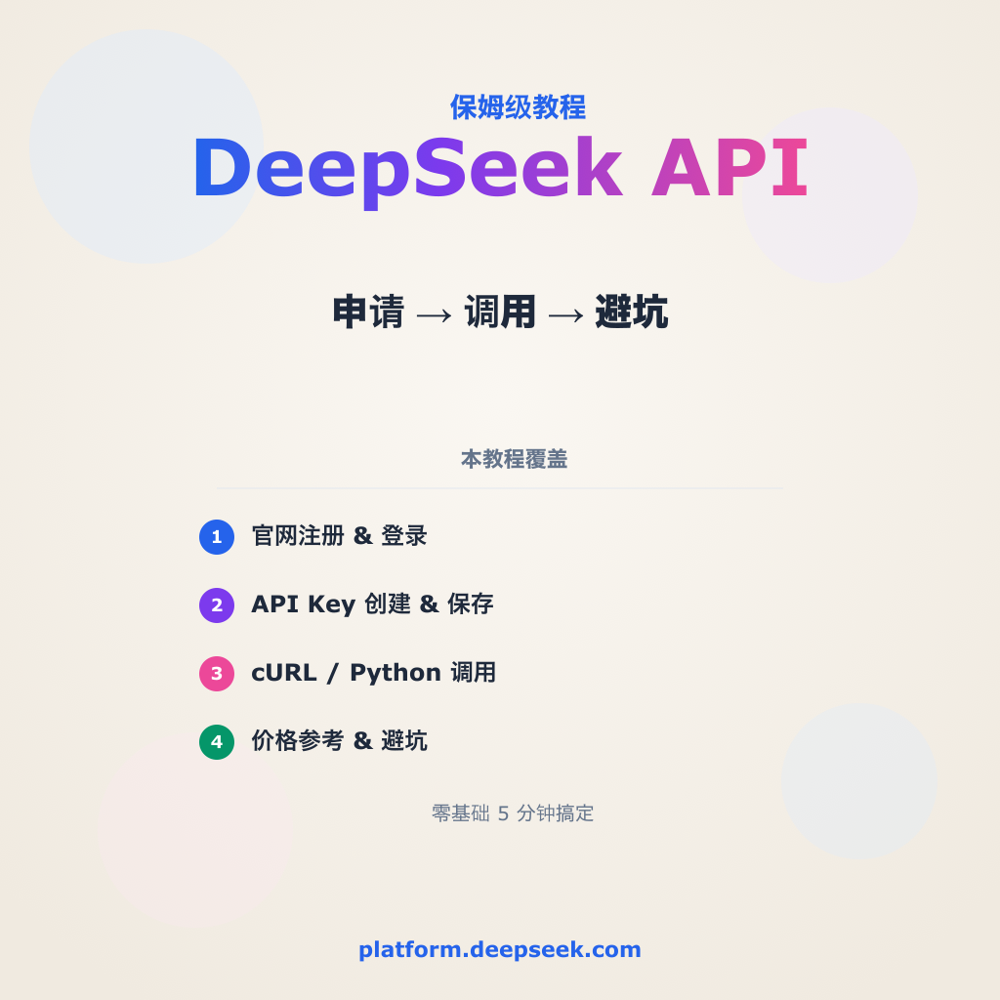

# DeepSeek API 申请保姆级教程

> 小红书风格文章 · 2026-06-03
> 手把手教你拿到 DeepSeek API Key，5 分钟开搞！



---

## 📖 正文

### 为什么要申请 DeepSeek API？

DeepSeek 的模型能力大家有目共睹——编程、写作、推理样样能打。但很多刚接触的同学卡在第一步：**API Key 怎么搞？**

别急，这篇从头到尾带你走一遍，零基础也能5分钟搞定。

---

### Step 1：打开官网

浏览器访问 **[platform.deepseek.com](https://platform.deepseek.com)**

> ⚠️ 注意是 platform.deepseek.com，不是 chat.deepseek.com！
> chat 是网页聊天窗口，platform 才是 API 管理后台。

---

### Step 2：注册 / 登录

- 新用户：点击右上角 **Sign Up**，邮箱注册
- 老用户：直接 **Log In**
- 支持邮箱 + 验证码登录，不需要翻墙

注册完成后，系统会赠送 **500 万 tokens** 免费额度（有效期 30 天），足够你玩很久。

---

### Step 3：进入 API Keys 页面

登录后，左侧导航栏找到 **API Keys**，点击进去。

你会看到一个简洁的密钥管理页面：
- 已有的密钥列表
- 一个「**+ Create API key**」按钮

---

### Step 4：创建 API Key

1. 点击 **+ Create API key**
2. 给密钥取个名字（比如「my-dev-key」）
3. 点击确认

创建成功后，密钥会**一次性显示**在屏幕上。

> ⚠️ **非常重要：立即复制保存！**
> DeepSeek 不会再次显示完整密钥，一旦关掉就再也看不到了。
> 建议存到密码管理器或 `.env` 文件里。

---

### Step 5：开始调用

拿到 API Key 后，用任何 HTTP 客户端都能调用：

```bash
curl https://api.deepseek.com/v1/chat/completions \
  -H "Content-Type: application/json" \
  -H "Authorization: Bearer sk-你的密钥" \
  -d '{
    "model": "deepseek-chat",
    "messages": [{"role": "user", "content": "你好！"}]
  }'
```

**Python 版：**

```python
from openai import OpenAI

client = OpenAI(
    api_key="sk-你的密钥",
    base_url="https://api.deepseek.com/v1"
)

response = client.chat.completions.create(
    model="deepseek-chat",
    messages=[{"role": "user", "content": "你好！"}]
)
print(response.choices[0].message.content)
```

---

### 💰 价格参考（截至 2026-06）

| 模型 | 输入 | 输出 |
|------|------|------|
| DeepSeek-V3 | ¥1 / 1M tokens | ¥2 / 1M tokens |
| DeepSeek-R1 | ¥4 / 1M tokens | ¥16 / 1M tokens |

比 GPT-4o 便宜 10-20 倍，性价比拉满。

---

### 📌 几点注意

1. **API Key 不要泄露** —— 别传到 GitHub 公开仓库
2. **免费额度用完会停** —— 需要去 Billing 页面充值
3. **支持 OpenAI SDK** —— base_url 改成 `https://api.deepseek.com/v1` 即可无缝迁移
4. **速率限制** —— 免费用户每分钟 60 次请求，够用

---

## 📂 文件清单

| 文件 | 说明 |
|------|------|
| `article.md` | 小红书发布草稿 |
| `README.md` | 本文 |
| `deepseek-square-cover.png` | Cover card (1024×1024) |
| `deepseek-card-1-signup.png` | Step 1-2: 注册登录 |
| `deepseek-card-2-apikey.png` | Step 3-4: 创建 API Key |
| `deepseek-card-3-code.png` | Step 5: 调用代码 |
| `deepseek-card-4-pricing.png` | 价格参考 |
| `deepseek-card-5-tips.png` | 注意事项总结 |
| `gen_cards.py` | SVG generator |
| `*.svg` | Card sources |

## 📝 信息来源

- [DeepSeek Platform](https://platform.deepseek.com)
- [DeepSeek API Docs](https://api-docs.deepseek.com)