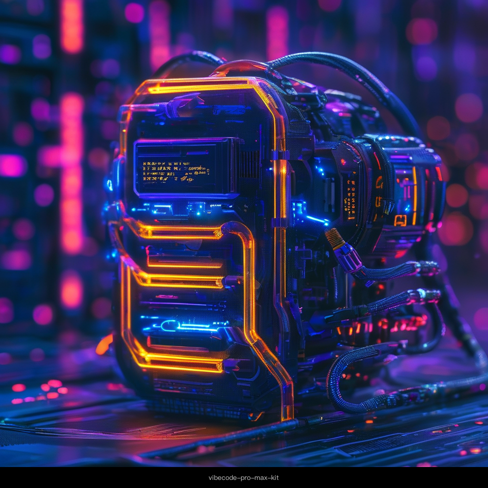
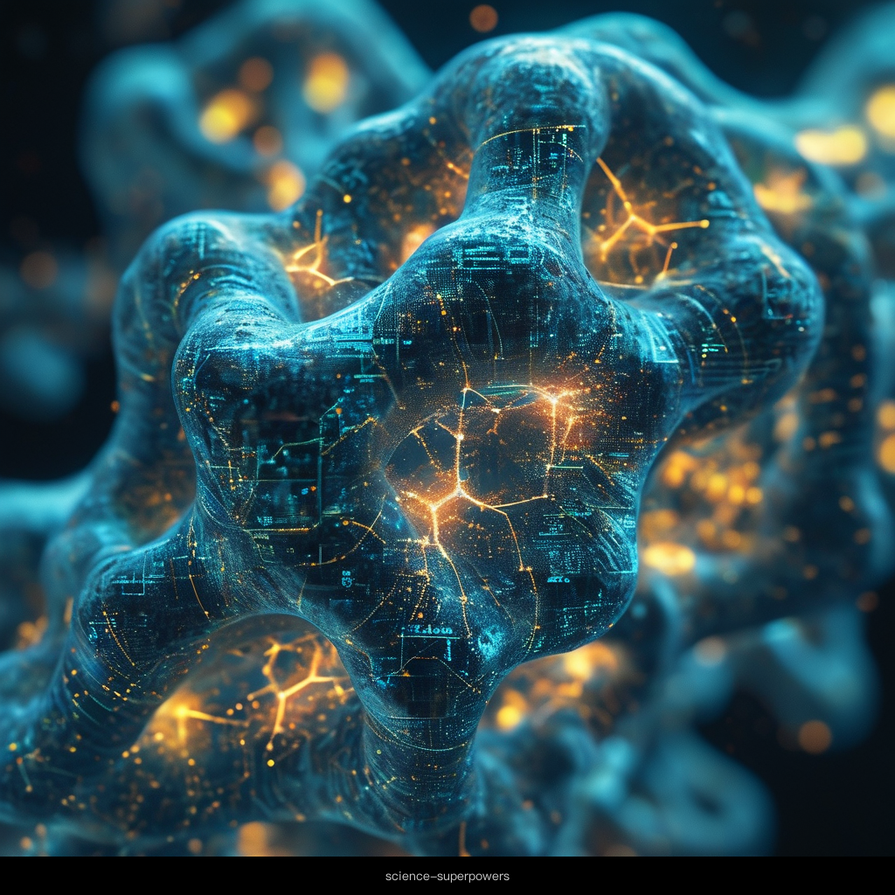

# GitHub AI Skills 今日 Top 10

> 2026-06-01 · AI Agent Skills · 按星数排序

---

## 1. revfactory/harness

| | |
|---|---|
| ⭐ | 4,901 |
| 📈 今日 | +323 |
| 🔤 | HTML · Apache-2.0 |
| 🏷 | claude-code, harness |

**元技能框架 — 自动设计领域专属 Agent 团队并生成对应技能。**

Harness 是一个"元技能"，它能分析你的需求，自动设计出由多个专业 Agent 组成的团队，并为每个 Agent 生成它们所需的技能文件。

---

## 2. op7418/guizang-social-card-skill

| | |
|---|---|
| ⭐ | 2,326 |
| 🔤 | HTML · AGPL-3.0 |
| 🏷 | claude-code, codex, agent-skill |

**Claude Code / Codex Skill — 生成小红书、公众号封面。**

28 种排版、10 种主题、瑞士视觉系统。单文件 HTML → PNG，无需外部依赖。编辑设计 × 系统化排版。

---

## 3. nicobailon/pi-subagents

| | |
|---|---|
| ⭐ | 1,958 |
| 📈 今日 | +69 |
| 🔤 | TypeScript |

**Pi Agent 的异步子代理扩展。**

支持子代理异步委派、截断、Artifacts 和会话共享。Pi Agent 生态的关键组件，让复杂任务拆解为多个子代理并行执行。

---

## 4. helloianneo/ian-xiaohei-illustrations

| | |
|---|---|
| ⭐ | 1,566 |
| 🔤 | MIT |
| 🏷 | codex-skill, illustration, chinese |

**中文小黑怪诞正文配图生成 Skill。**

16:9 白底手绘风格，少量红橙蓝批注点缀。专为 Codex 设计的插画生成技能，一键出图。

---

## 5. GordenSun/GordenPPTSkill

| | |
|---|---|
| ⭐ | 1,264 |
| 🔤 | Python |
| 📜 | 个人/研究用途 |

**AI 友好的 PPT 生成 Skill。**

17 套精校中文 PPTX 模板 + 无损纯文本编辑工具。挑模板、写 edits.json、生成真正的 .pptx。布局完全保留。

---

## 6. withkynam/vibecode-pro-max-kit

| | |
|---|---|
| ⭐ | 688 |
| 🔤 | JavaScript · MIT |
| 🏷 | agentic, ai-agents, claude-code |

**不让你 AI 失忆的编码框架。**

12 个 Agent、32 个 Skills、自改进上下文记忆。Spec-driven 编码，干掉上下文腐烂，Claude Code & Codex 双兼容。

---

## 7. liyue-aigc/female-portrait-director

| | |
|---|---|
| ⭐ | 355 |
| 🔤 | MIT |
| 🏷 | codex-skill, prompt-engineering |

**模块化 Codex Skill — AI 女性人像提示词导演。**

可扩展的提示词生成框架，精细控制人像的每处细节。从光线、构图到风格，逐层展开。

---

## 8. DannyMac180/skills

| | |
|---|---|
| ⭐ | 232 |
| 🔤 | Python · MIT |

**AI Agent Skills 合集仓库。**

Dan McAteer 创作的多款实用 Agent Skills。适合作为学习和参考的 skills 样板库。

---

## 9. K-Dense-AI/science-superpowers

| | |
|---|---|
| ⭐ | 157 |
| 🔤 | Shell |

**计算科学方法论 Skills — 面向 AI 研究 Agent。**

Superpowers 的科学领域重实现。预注册优于 TDD，可组合的计算科学方法论，为 AI 研究代理设计。

---

## 10. nekocode/filetree-skill

| | |
|---|---|
| ⭐ | 129 |
| 🔤 | Python |
| 🏷 | agent, ai, skills |

**Claude Code 插件 — 自动维护 `FILETREE.md`。**

保持项目文件树文档与代码结构同步。简单实用，适合任何需要文件导航的 AI 编程工作流。

---

*数据来源：GitHub Search · 统计时间 2026-06-01*
