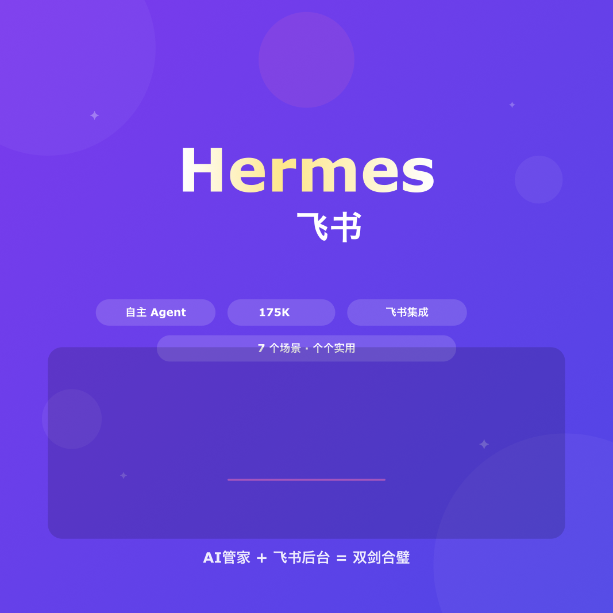

# Hermes 🤝 飞书：AI 管家接管飞书后台

> 小红书风格文章 · 2026-06-03
> Hermes Agent · 175K+ Stars · MIT



---

## 📖 文章正文

之前写过 Hermes Agent 的评测 — 一个跑在服务器上的自主 AI Agent。当时说它接的通信工具够多，13 个平台全兼容。

但深度用了两个月后，发现真正让效率质变的组合是：**Hermes + 飞书**。

---

先说 Hermes 是什么。

不是聊天机器人。你不需要每句话都在对话框里等它回复。
不是代码助手。它不绑定 IDE。

它是一个跑在你服务器上的 Agent，你跟它说完需求它就自己去干了。有点像请了个远程实习生，分配完任务就不用管了。

那跟飞书结合能干什么？6 个场景 + 1 个架构亮点。

---

**① 先搞清楚它不干什么**

不是聊天机器人，不是代码助手。它是一个自主 Agent，你跟它说需求它自己去干。记忆是跨会话的 — 今天教它怎么处理某个报错，下周再遇到自己就搞定了。

**② 飞书日程，一句话安排**

「明天下午2点跟市场部开会，帮我约李姐和张工」
Hermes 自动查飞书日历、找大家空闲时间、发会议邀请。不用打开飞书网页，不用切 App，终端敲一行完事。

底层是 QClaw（OpenClaw）的飞书 Calendar API 封装。

**③ 飞书消息，它帮你盯**

指定一个群，Hermes 帮你 7×24 监控：
- 关键词触发自动回复
- 常见问题自动应答
- 紧急通知转发到 Telegram
- 半夜有人@你，Hermes 先处理一轮

**④ Bitable，自动录数据**

多维表格用得越深，手动粘贴的痛越明显。Hermes 配合飞书 Base API：
- 爬到的信息自动写入
- 定时同步外部数据库
- 一条指令批量修改 500 行

**⑤ 文档草稿，自动生成**

「写一份本周的飞书项目周报，上一周的结论放在附录」
Hermes 自动检索飞书文档、汇总信息、排版输出。技术方案、周报、会议纪要全包。

**⑥ 审批流程，不用盯**

报销自动审批（金额 < 500 直接过，> 500 转主管），请假智能判断（剩余额度充足自动批，不足标记异常）。规则灵活配置，不漏单不卡单。

**⑦ 双内核：飞书 + Telegram 同时管**

这是 QClaw 最新版的核心架构升级 — 叫「双内核」：
- **OpenClaw** 管飞书（日历、消息、文档、表格、审批…）
- **Hermes** 管 Telegram、Slack 等其他通信工具
- 两个 Agent 共享技能库

同一台机器上，互不干扰又协同工作。圈里有人开玩笑说这叫「养虾又养马」— 虾是 QClaw，马是 Hermes。

---

安装 Hermes：

```bash
curl -fsSL https://hermes-agent.nousresearch.com/install.sh | bash
```

飞书这边需要安装 OpenClaw（QClaw），跑 `lark-cli auth login` 完成飞书授权。

两个都有，你就能实现：**在 Telegram 里发指令 → 自动操作飞书**。

---

## 📂 文件清单

| 文件 | 说明 |
|------|------|
| `README.md` | 本文（完整博客版） |
| `article.md` | XHS 纯正文（含标题、图片映射、发布命令） |
| `hermes-feishu-cover.png` | 封面卡 (1024×1024) |
| `hermes-feishu-card-1.png` | ① 先搞清楚它不干什么 |
| `hermes-feishu-card-2.png` | ② 飞书日程，一句话安排 |
| `hermes-feishu-card-3.png` | ③ 飞书消息，它帮你盯 |
| `hermes-feishu-card-4.png` | ④ Bitable，自动录数据 |
| `hermes-feishu-card-5.png` | ⑤ 文档草稿，自动生成 |
| `hermes-feishu-card-6.png` | ⑥ 审批流程，不用盯 |
| `hermes-feishu-card-7.png` | ⑦ 双内核：飞书+Telegram |
| `gen_cards.py` | SVG 生成脚本 (Python 3 + Inkscape) |

## 🎨 设计要点

- **配色**: 浅色风格 v2，米白渐变背景 #FAF7F2 → #F1F5F9
- **卡片**: 白色圆角卡片 + 顶部彩色色块 + 大标题
- **编号**: ①-⑦ 超大字重编号，爆款列表式排版
- **图标**: 每张卡一个 emoji 图标，增加视觉记忆点
- **风格**: 7 张内容卡 + 1 张封面，适合小红书 8 图轮播

## 📝 信息来源

- [Hermes Agent](https://hermes-agent.nousresearch.com/) · Nous Research
- [Hermes GitHub](https://github.com/NousResearch/Hermes) · 175K+ Stars
- QClaw / OpenClaw 双内核架构文档
