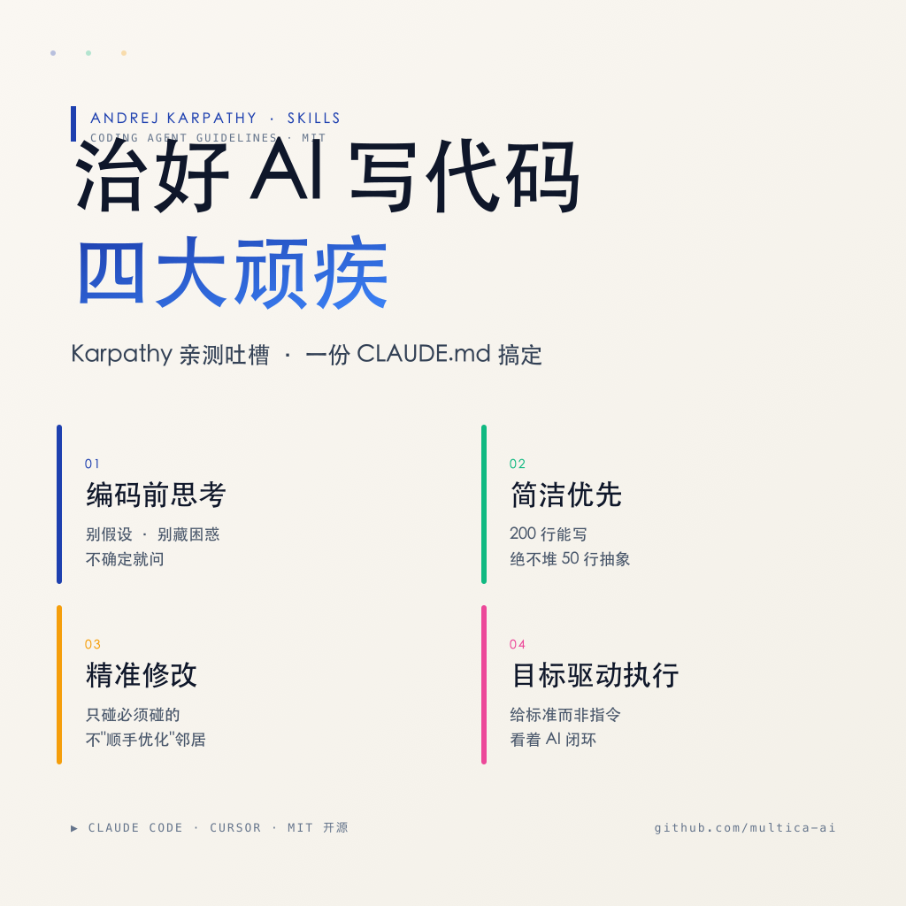

# Karpathy 亲自吐槽 AI 写代码,他给的解法是这套 Skill 🔥

> 小红书风格文章 · 2026-06-02 · 正文 ~812 字
> 项目地址: https://github.com/multica-ai/andrej-karpathy-skills
> 灵感来源: Andrej Karpathy 的推文吐槽

---

## 📖 文章正文

用 AI 写代码的人,有没有这几个崩溃瞬间 🙃

100 行能搞定的事,AI 非要写成 1000 行;
让它改个 bug,它顺手把隔壁注释、变量全"优化"了;
明明逻辑不通,它也不问一句,直接闷头猛写……

**这不是 Bug,是 LLM 的通病。**

Andrej Karpathy(前特斯拉 AI 总监 / OpenAI 创始成员)亲自在 X 上吐槽过 👇

> "模型替你做错误假设,然后不假思索地执行 · 100 行的事非写成 1000 行的臃肿架构 · 该反驳时也不反驳。"

太精准了 😅 于是有大佬把 Karpathy 的观察整理成了一个开源 Skill 👇
**andrej-karpathy-skills** —— 一份 `CLAUDE.md` 治好 AI 的四大顽疾 ✨



---

### 🎯 四大原则(对症下药)

| 原则 | 治什么病 |
|------|------|
| **编码前思考** | 瞎假设、藏困惑 |
| **简洁优先** | 过度工程、臃肿抽象 |
| **精准修改** | 顺手改无关代码 |
| **目标驱动执行** | 弱标准导致返工 |

---

### 1️⃣ 编码前思考 —— 别假设,别藏困惑

- ✅ 不确定就**问**,不要猜
- ✅ 有歧义就**列出多种解释**
- ✅ 困惑时**停下来要澄清**

### 2️⃣ 简洁优先 —— 200 行能写,绝不堆 50 行抽象

- 🚫 不加要求外的功能
- 🚫 不为一次性代码搞抽象
- 🚫 不加未要求的"灵活性"

**检验:** 资深工程师看了觉得过于复杂? → 重写。

### 3️⃣ 精准修改 —— 只碰必须碰的

- ❌ 不"改进"相邻代码、注释、格式
- ❌ 不重构没坏的东西
- ✅ 看到无关死代码 → 提一下,别删

**检验:** 每一行改动都能追溯到用户请求。

### 4️⃣ 目标驱动执行 —— 给标准而非指令

| 不要 | 改成 |
|------|------|
| "添加验证" | "为无效输入写测试,让它通过" |
| "修复 bug" | "先写重现 bug 的测试,再让它过" |

> Karpathy 原话:**"不要告诉它做什么,给它成功标准,然后看着它完成。"**

---

### 🛠️ 安装(两步走)

**Claude Code 插件:**
```
/plugin marketplace add forrestchang/andrej-karpathy-skills
/plugin install andrej-karpathy-skills@karpathy-skills
```

**或直接下载 CLAUDE.md** + Cursor 用户仓库自带规则 ✅

---

### 💡 一句话总结

> **Karpathy 的洞察 + 一份 markdown,治好 AI 四大顽疾。**
> 它没让 AI 变聪明,而是给了它"做事的规矩"——
> 不假设、不复杂、不乱碰、不模糊 😎
> MIT 协议 · 零成本 · 5 分钟接入。

---

**你被 AI "自作主张改了无关代码"坑过吗?评论区聊聊 👇**

`#AI编程` `#ClaudeCode` `#Cursor` `#Karpathy` `#开源工具` `#Skills`

---

## 📂 文件清单

| 文件 | 说明 |
|------|------|
| `README.md` | 本文(文章 + 描述) |
| `karpathy-skills-banner.png` | 横版配图 (1792×1024),适合微博/头图 |
| `karpathy-skills-square.png` | 方版配图 (1024×1024),适合小红书封面 |

## 🔗 相关链接

- GitHub 仓库: https://github.com/multica-ai/andrej-karpathy-skills
- 中文 README: https://github.com/multica-ai/andrej-karpathy-skills/blob/main/README.zh.md
- Karpathy 原推: https://x.com/karpathy/status/2015883857489522876
- Multica 平台: https://github.com/multica-ai/multica
