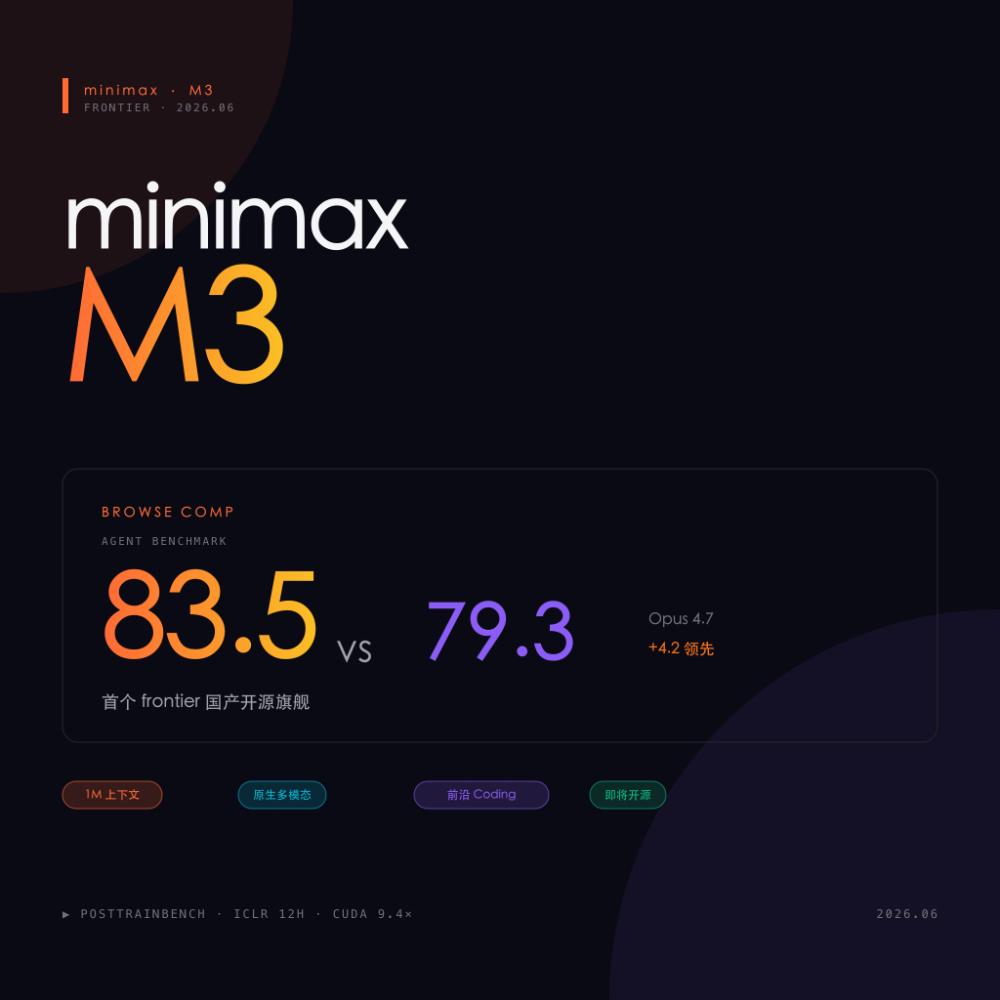
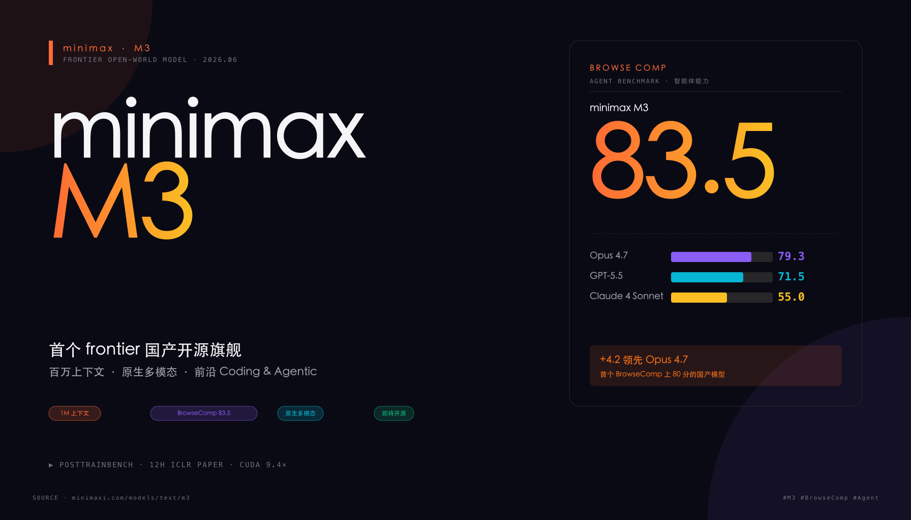
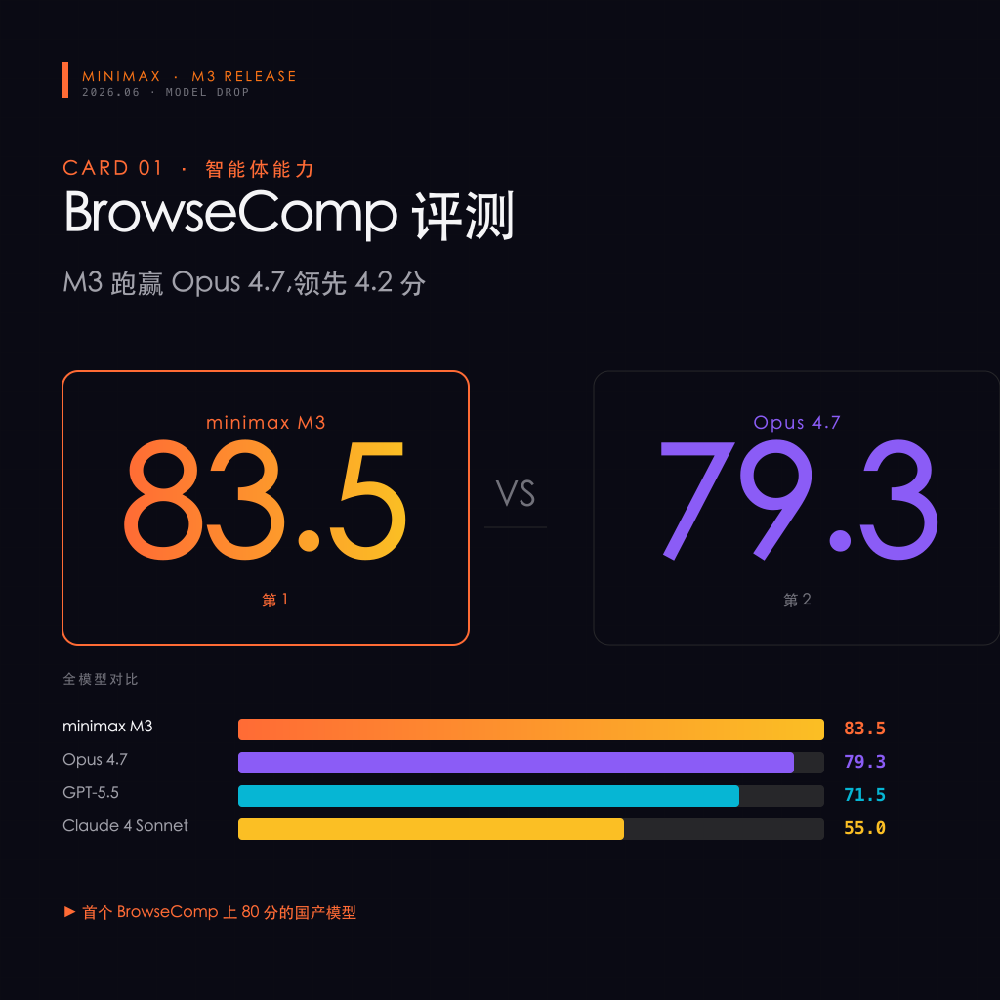
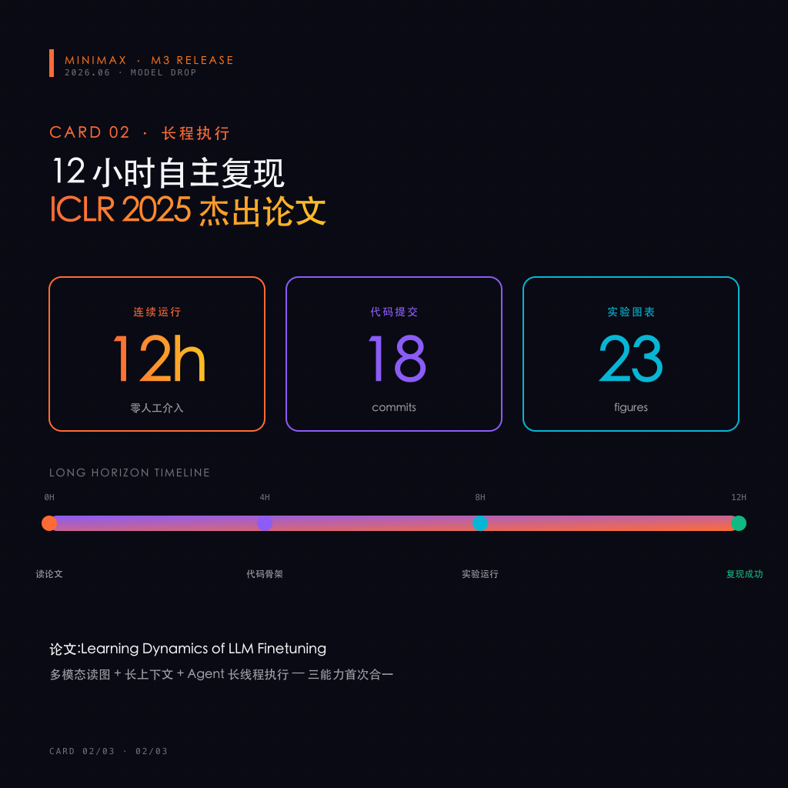
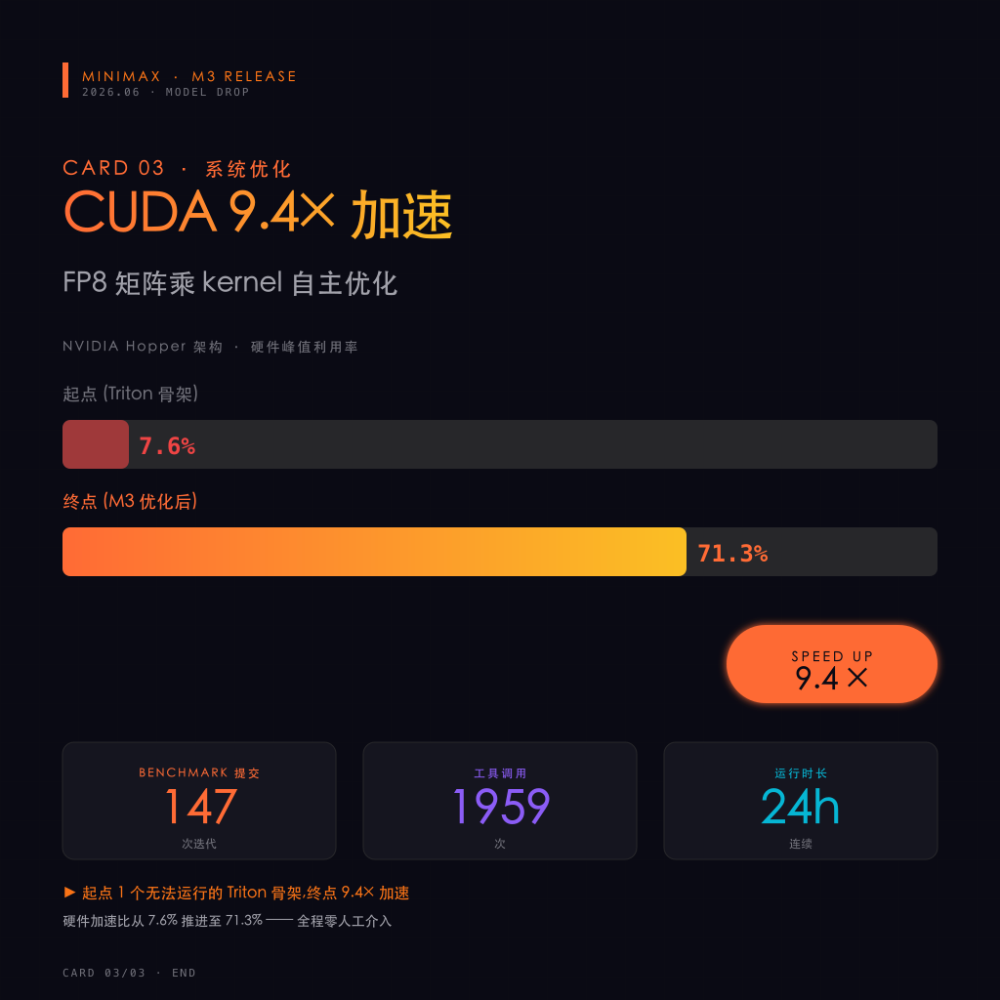

# 重磅!minimax M3 发布 🔥 BrowseComp 83.5 跑赢 Opus 4.7,首个 frontier 国产开源旗舰

> 小红书风格文章 · 2026-06-02
> 来源: [minimaxi.com/models/text/m3](https://www.minimaxi.com/models/text/m3)

---

## 📖 文章正文

**minimax 又扔核弹了 💣 —— M3 来了**

今天凌晨,minimax 正式发布 **MiniMax M3**。这可能是 2026 年最重磅的国产模型发布:

> 首个三项能力兼备的国产旗舰,
> **第一个把完整 frontier 能力带进开放世界的模型**。

三个"第一"摆在桌上,直接上硬菜 👇

### 🎯 M3 到底强在哪?

**1️⃣ BrowseComp 智能体评测 83.5 分,反超 Opus 4.7(79.3) 🔥🔥🔥**

这是 OpenAI 主导的智能体能力测试 —— 让模型自主浏览网页、检索信息、解决真实问题。
- **M3: 83.5**
- Opus 4.7: 79.3
- **领先 4.2 分**

国产模型第一次在智能体任务上正面跑赢 Anthropic 旗舰。

**2️⃣ 百万 Token 上下文 + 自研 MSA 架构 📚**

API 最高支持 **1M tokens 上下文窗口**,至少 512K tokens 可用。
1M 上下文 = 一次性吞下整本《战争与和平》+ 完整代码仓库 + 几小时长视频。

底座是自研 **MiniMax Sparse Attention (MSA)**:稀疏注意力架构,在不损失质量的前提下,把长文本推理成本压下来。

**3️⃣ 原生多模态(不是贴图层) 👁️**

大部分"多模态模型"其实是文本模型 + 视觉编码器后期拼装的。
M3 **从第零步开始多模态训练**:把预训练数据规模扩充到 **百 T 量级**,文本和视觉语义空间高度对齐。

> 看图、读公式、理解长视频 —— 是刻在模型骨子里的能力,不是外挂。

### 🔥 三个硬核 demo,看得见的强

M3 团队放出了 3 个真实长跑任务,**全程零人工介入**:

**📄 论文复现:12 小时自主完成 ICLR 2025 杰出论文**

丢一篇 ICLR 2025 杰出论文 *"Learning Dynamics of LLM Finetuning"* 给 M3,让它独立复现。
- 连续运行 **12 小时**
- 自主产出 **18 次 commit** + **23 张实验图表**
- 成功跑通核心实验
- 多模态读图 + 长上下文吞论文 + Agent 长线程执行,三能力首次合一

**⚡ CUDA 算子优化:147 次迭代,9.4× 加速**

FP8 矩阵乘是大模型推理最热的算子。起点只有一个无法运行的 Triton 骨架。
- 约 24 小时
- **147 次 benchmark 提交**
- **1959 次工具调用**
- 硬件峰值利用率从 **7.6% → 71.3%**
- 实现 **9.4× 加速**
- **全程零人工介入**

**🧠 PostTrainBench:让 M3 自己「训」模型**

给 M3 四个只完成预训练的 Base 模型,要求 12 小时内自主完成 数据合成 → 训练 → 评测 →迭代 全流程。
- M3 最终得分 **37.1**
- 排名:**第 3**
- 仅次于 Opus 4.7(42.4)和 GPT-5.5(39.3)
- **明显领先其余模型**

### 📊 M3 vs 顶级闭源旗舰速览

| 指标 | minimax M3 | Opus 4.7 | GPT-5.5 |
|------|----------|----------|---------|
| BrowseComp | **83.5** ✅ | 79.3 | — |
| PostTrainBench | **37.1** | 42.4 | 39.3 |
| 上下文窗口 | **1M tokens** | 200K | 400K |
| 架构 | MSA 稀疏注意力 | — | — |
| 多模态 | **原生(从零训练)** | 后整合 | 后整合 |
| 开源 | **即将开源** ✅ | 闭源 ❌ | 闭源 ❌ |

> 国产模型第一次在"硬核长程任务"上**正面和闭源旗舰掰手腕**。

### 🛒 怎么用?四种姿势随便挑

**姿势 1:Token Plan 订阅** 💰
- 老用户**自动升级**,价格不变
- 编码 + 推理能力直接拉满
- 👉 [platform.minimaxi.com/subscribe/token-plan](https://platform.minimaxi.com/subscribe/token-plan)

**姿势 2:开放平台 API** 🔌
- 最高 1M tokens 上下文
- v2 API,支持**自动 Cache**(无需设置)
- 👉 [platform.minimaxi.com](https://platform.minimaxi.com/docs/guides/text-generation)

**姿势 3:MiniMax Code** 🤖
- 基于 M3 的通用 Agent 平台
- 无需任何开发,直接体验编码 Agent + 多模态理解
- 👉 [code.minimaxi.com](https://code.minimaxi.com/)

**姿势 4:开源 + 本地部署** 🛠️
- 即将在 **HuggingFace** 和 **GitHub** 上开源
- 支持私有集群部署和微调
- 👉 [huggingface.co/MiniMaxAI](https://huggingface.co/MiniMaxAI)

**🎁 彩蛋:支持 10 大编码工具**
Claude Code · Roo Code · Kilo Code · Cline · Codex CLI · **OpenCode** · Droid · TRAE · Grok CLI · Cursor

### 💸 邀请返利彩蛋

- 邀请者:**10% 代金券**返利
- 被邀请者:**9 折** 优惠
- 👉 Token Plan 订阅页直接生成邀请码

### 💡 一句话总结

> **M3 不是一个新模型,是 frontier 能力第一次"破壁"进开源世界。**

对国产开发者来说:
- **BrowseComp 83.5 / PostTrainBench 37.1** —— 硬指标已对标闭源旗舰
- **1M 上下文 + 原生多模态** —— 基础设施级别领先
- **即将开源** —— 可私有部署、可微调、不被锁定

> **2026 年,frontier 不再只属于几家闭源巨头。**

---

**你看好 M3 吗?会用它做点什么?评论区聊聊 👇**

`#AI` `#minimax` `#M3` `#国产大模型` `#AgenticAI` `#开源` `#AI编程` `#大模型` `#深度学习` `#开发者`

---

## 📂 文件清单

| 文件 | 说明 |
|------|------|
| `README.md` | 本文(文章 + 描述) |
| `m3-banner.png` | 横版配图 (1792×1024),适合微博/头图 |
| `m3-square.png` | 方版封面 (1024×1024),适合小红书 |
| `m3-card-1.png` | 特性卡 1:BrowseComp 83.5 跑赢 Opus 4.7 |
| `m3-card-2.png` | 特性卡 2:12 小时自主复现 ICLR 论文 |
| `m3-card-3.png` | 特性卡 3:CUDA 9.4× 加速(147 次迭代) |
| `gen_cards.py` | SVG 生成脚本 |
| `m3-*.svg` | SVG 源文件 |

## 📝 信息来源

- [minimax M3 模型页](https://www.minimaxi.com/models/text/m3)
- [minimax M3 报告](https://www.minimaxi.com/blog/minimax-m3)
- [Token Plan 订阅](https://platform.minimaxi.com/subscribe/token-plan)
- [MiniMax Code 体验](https://code.minimaxi.com/)
- [Hugging Face 开源仓库](https://huggingface.co/MiniMaxAI)
