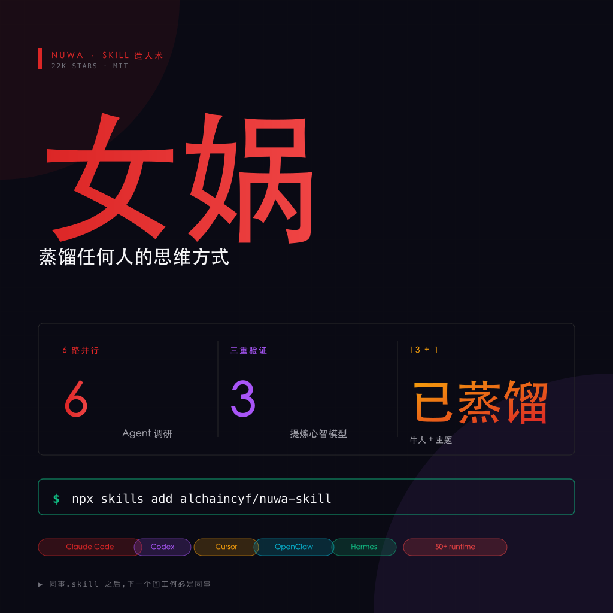
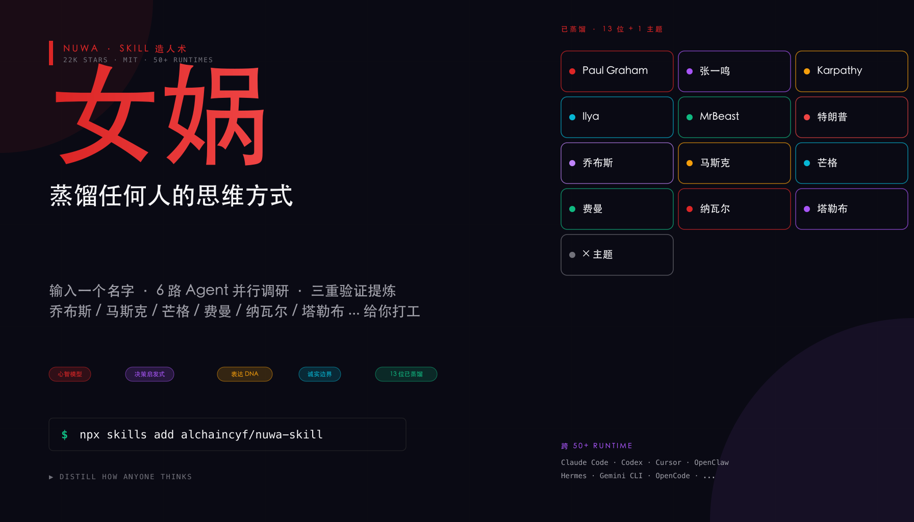

# 聊聊 女娲 让牛人思维给你打工 🧬 输入名字一键蒸馏

> 小红书风格文章 · 2026-06-02
> 来源: [github.com/alchaincyf/nuwa-skill](https://github.com/alchaincyf/nuwa-skill) · 22K Stars · MIT





---

## 📖 文章正文

之前看到同事.skill 把离职同事蒸馏成 AI Skill，几千星爆火。

当时心想：能蒸同事，那能不能蒸乔布斯、马斯克、芒格？

然后就被安利到了花叔做的 **女娲.skill**。

---

它不是普通的"名人语录合集"。

你给它一个名字，它会派 **6 个 Agent 并行干活**：

📚 读这个人的所有书
🎙 扒所有播客、访谈、公开演讲
🗣 翻他所有社交媒体发言
👀 找批评者是怎么骂他的
🧭 把他做过的关键决策扒出来
🕰 拉一条人生时间线

六路同时跑，每路都存档。

---

跑完不是直接堆成文档。

还要过 **三重验证**：

✅ 这个观点是否在 2 个以上领域反复出现过（不是随口一说）
✅ 能不能拿来预判他对新问题的立场（有预测力）
✅ 是不是只有他这么想，别的聪明人不会这么想（有排他性）

三个都过，才收录为心智模型。

只过两个的，直接丢进"观察"分类。

一个过的，叫"语录"，不写进 Skill。

---

最爽的是**直接能用**。

13 位牛人 + 1 个主题已经蒸好了，一键装：

🔥 Paul Graham · 张一鸣 · Karpathy · Ilya Sutskever · MrBeast · 特朗普
⭐ 乔布斯 · 马斯克 · 芒格 · 费曼 · 纳瓦尔 · 塔勒布

想用谁就直接对 Agent 说：

> "用芒格的视角分析这笔投资"
> "费曼会怎么解释量子计算？"
> "切到纳瓦尔，我在三件事之间纠结"

它就以那个人的思维方式跟你聊。

---

装起来也简单。

```bash
npx skills add alchaincyf/nuwa-skill
```

一行命令，自动识别你用的 Agent：Claude Code、Codex、Cursor、OpenClaw、Hermes、CodeBuddy、Gemini CLI、OpenCode…

50+ 兼容 runtime，不用挑。

---

想蒸不在列表里的人？

直接对 Agent 说「蒸馏一个 XXX」就完事。

调研 → 提炼 → 验证 → 打包成 Skill，全流程自动。

GitHub 22K Star，MIT 开源。

🔗 github.com/alchaincyf/nuwa-skill

`#女娲skill` `#AI工具` `#Agent` `#开源` `#思维模型` `#认知升级` `#AI编程`

---

## 📂 文件清单

| 文件 | 说明 |
|------|------|
| `README.md` | 本文(文章 + 描述) |
| `article.md` | XHS 纯正文(945 字符,适合直接粘贴到草稿) |
| `nuwa-square.png` | 方版封面 (1024×1024),适合小红书缩略图 |
| `nuwa-banner.png` | 横版配图 (1792×1024),适合微博/头图 |
| `nuwa-card-1.png` | 特性卡 1:6 路 Agent 并行调研 |
| `nuwa-card-2.png` | 特性卡 2:5 层心智模型提取 |
| `nuwa-card-3.png` | 特性卡 3:13 位已蒸馏牛人 |
| `nuwa-card-4.png` | 特性卡 4:一行命令跨 50+ runtime |
| `gen_cards.py` | SVG 生成脚本 (Python 3 + Inkscape) |
| `nuwa-*.svg` | SVG 源文件(可重新导出) |

## 🎨 设计要点

- **配色**: DARK 主题,主色 #DC2626 (红,匹配 GitHub nuwa-skill 视觉) + #A855F7 (紫,女娲神话感) + #F59E0B (金,炼金/创造)
- **风格**: 大字号 + 深色面板 + 左侧色条 + 圆点装饰
- **底部统一话题标签**,符合 XHS 视觉规范

## 📝 信息来源

- [nuwa-skill GitHub](https://github.com/alchaincyf/nuwa-skill)
- [花叔 README (EN)](https://github.com/alchaincyf/nuwa-skill/blob/main/README_EN.md)
- [EverythingSkill · nuwa-skill](https://everythingskill.net/zh/skills/nuwa-skill)
- 22K Stars · MIT License · 作者: 花叔 Huashu (@AlchainHust)
