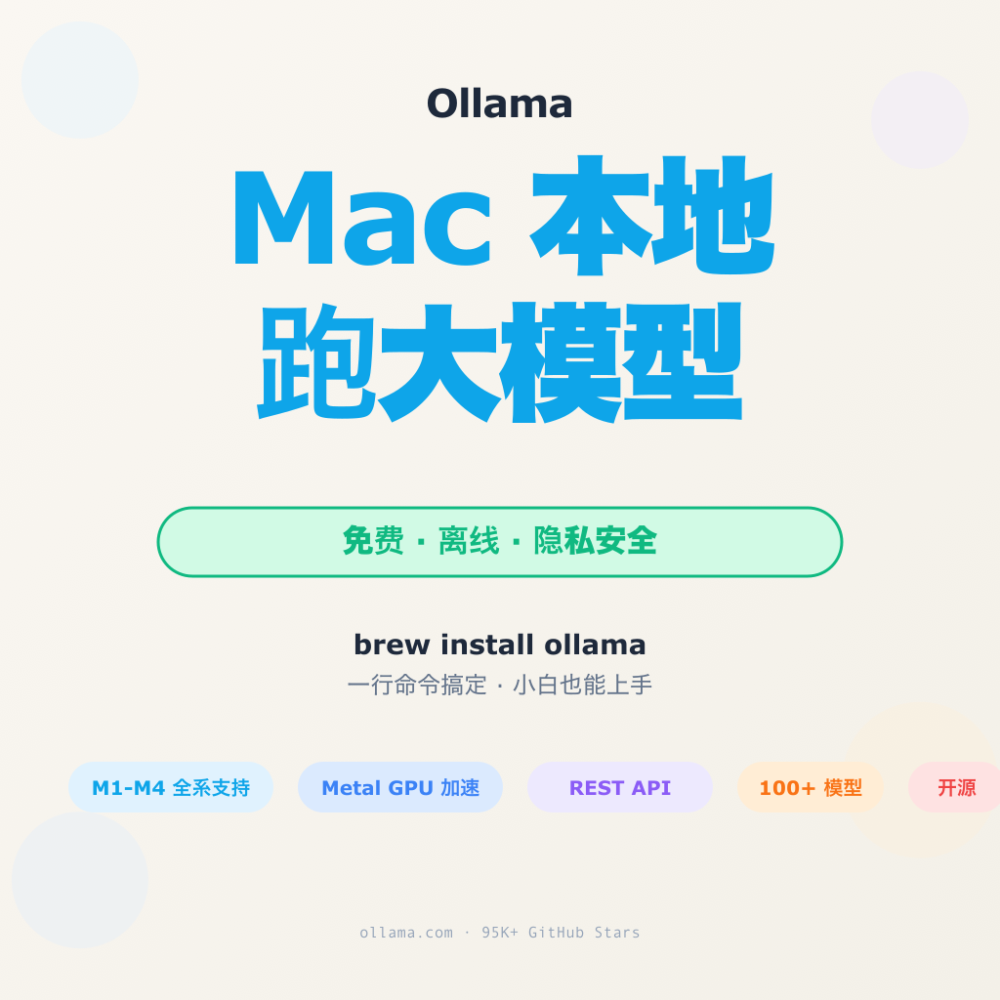
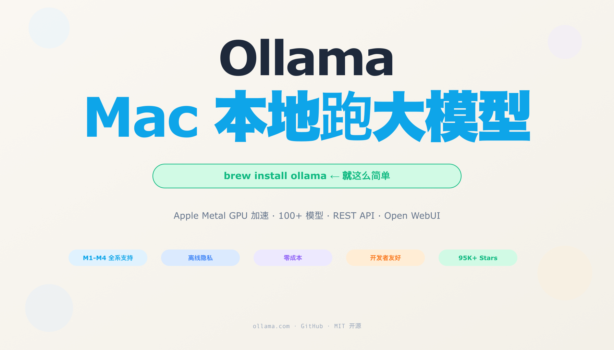

# Ollama MacBook 本地跑大模型 🔥 免费 · 离线 · 隐私安全

> 小红书风格文章 · 2026-06-03
>
> **飞书文档预览：** https://www.feishu.cn/docx/P99KdKUbcoMULexebgmcjBgJn2b





---

## 📖 文章正文

**你的 MacBook 也能跑大模型，而且比你想象的简单。**

Ollama 是目前最流行的本地大模型管理工具，96,000+ GitHub Stars。它把大模型封装得像 Docker 一样易用 —— 一行命令下载、一行命令运行、一行 API 调用。

### 为什么需要本地跑？

1. **完全免费，不限次数** —— 不用买 ChatGPT Pro，不按 token 计费
2. **隐私安全** —— 数据不出本机，敏感信息零泄露
3. **离线可用** —— 飞机高铁没网也能用
4. **Apple Metal GPU 加速** —— MacBook 的 Unified Memory 是天然优势

### 🔧 安装 4 步走

打开终端，复制粘贴即可：

```bash
# 1. 安装 Ollama
brew install ollama

# 2. 启动服务
ollama serve

# 3. 下载模型（以 Qwen 2.5 7B 为例）
ollama pull qwen2.5:7b

# 4. 运行对话
ollama run qwen2.5:7b
```

就是这么简单。首次下载模型需要网络（约 4-8 GB），之后全程离线。

### 💻 你的 Mac 能跑啥？

| Mac 配置 | 推荐模型 | 速度参考 |
|----------|----------|-----------|
| M1/M2 8GB | Qwen 2.5:1.5b / Phi-4-mini | 15-30 tok/s |
| M1/M2 16GB | Qwen 2.5:7b / Llama 3.2:8b | 25-40 tok/s |
| M1 Pro/Max 16GB+ | DeepSeek-R1:14b / Qwen 2.5:14b | 15-25 tok/s |
| M2 Ultra / M3 Max | Qwen 2.5:32b / Llama 3.3:70b | 8-20 tok/s |

**16GB 是甜点配置**，7B 参数模型流畅跑，日常编程、写作、翻译完全够用。Qwen 2.5 系列是性价比之王，同等大小下表现优于很多英文模型。

### 🚀 进阶玩法

**REST API** —— 让其他应用调用本地模型：

```bash
curl http://localhost:11434/api/generate \
  -d '{"model":"qwen2.5:7b","prompt":"你好"}'
```

**Python SDK** —— 写代码调用：

```python
import ollama
response = ollama.chat(model='qwen2.5:7b', messages=[{'role':'user','content':'你好'}])
```

**Open WebUI** —— 浏览器里的 ChatGPT 体验：

```bash
docker run -d -p 3000:8080 ghcr.io/open-webui/open-webui:main
```

然后打开 `http://localhost:3000`。

**Continue.dev** —— VS Code / Cursor 内本地 AI 编程助手：

在 Continue 配置中设置 `baseUrl: http://localhost:11434`，选择 Ollama 即可。

### ⚡ 性能调优

```bash
export OLLAMA_NUM_PARALLEL=4
export OLLAMA_MAX_LOADED_MODELS=2
```

关掉 Chrome、微信等后台应用释放内存，推理速度翻倍不是梦。

---

**全免费 · 零门槛 · 你的私人 AI 服务器。Ollama 让本地跑大模型不再是极客专利。**

> 你觉得本地跑大模型够用吗？评论区聊聊你的配置 👇

---

## 📂 文件清单

| 文件 | 说明 |
|------|------|
| `README.md` | 本文 |
| `article.md` | 小红书发布稿 |
| `gen_cards.py` | SVG 生成脚本 |
| `ollama-square.png` | 方版封面 (1024×1024) |
| `ollama-card-1.png` | 什么是 Ollama |
| `ollama-card-2.png` | 4 步安装教程 |
| `ollama-card-3.png` | 模型推荐表 |
| `ollama-card-4.png` | 进阶玩法 |
| `ollama-banner.png` | 横版 banner (1792×1024) |
| `ollama-*.svg` | SVG 源文件 |

## 📝 信息来源

- [Ollama 官网](https://ollama.com)
- [Ollama GitHub](https://github.com/ollama/ollama)
- [Ollama Model Library](https://ollama.com/library)
- [Open WebUI](https://github.com/open-webui/open-webui)
- [Continue.dev](https://continue.dev)
