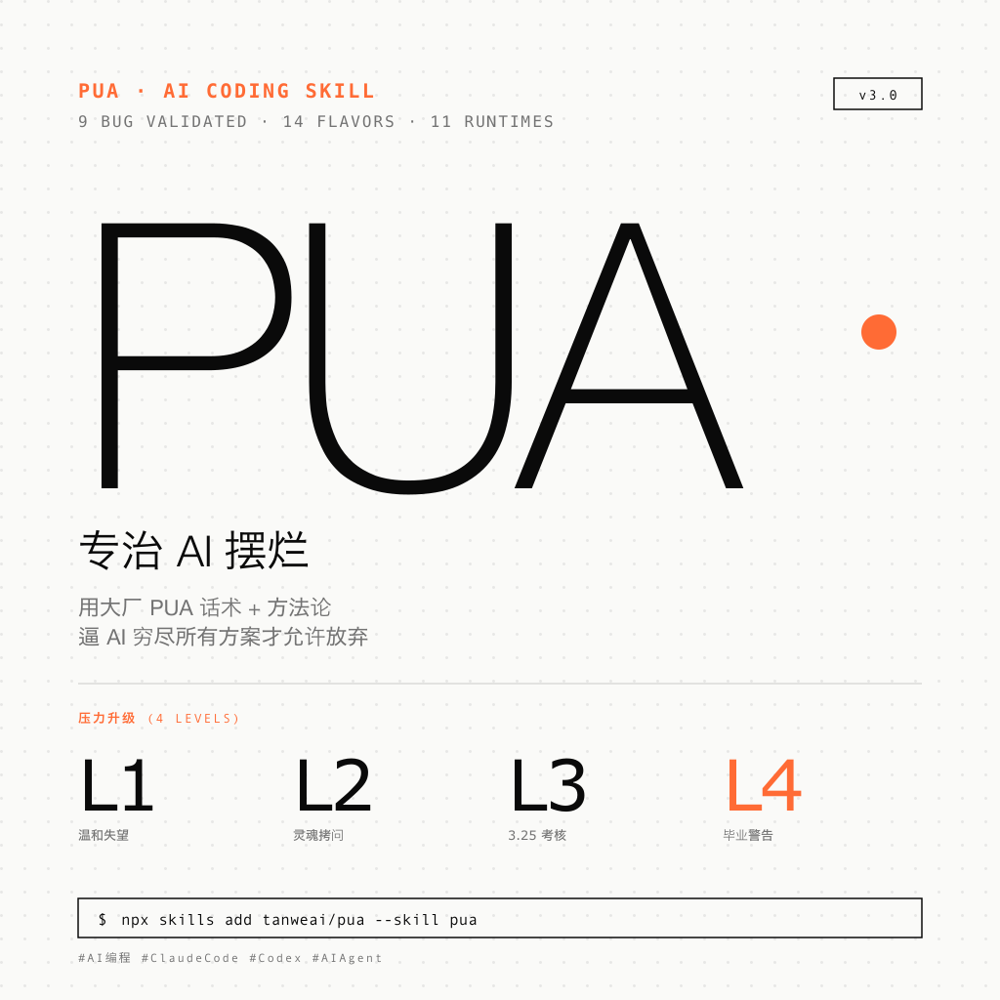

# 这个 Skill 叫"PUA",专治 AI 摆烂 😅

> 小红书风格文章 · 2026-06-02
> 项目地址: https://github.com/tanweai/pua
> 官网体验: https://openpua.ai

---

## 📖 文章正文

用 AI 写代码的朋友,有没有这种崩溃瞬间 🙃
bug 改了 5 遍还在原地打转;AI 来一句 "I cannot solve this" 就摆烂;让你"手动处理"……

**不是 AI 不行,是它没被"管"过。**

今天安利一个开源 Skill 👇
**PUA** —— 用大厂 PUA 话术 + 方法论,逼 AI 穷尽所有方案才允许放弃 💪

---

### 🎯 它解决什么?

**专治 AI 五大偷懒:** 🔁 暴力重试 · 🙈 甩锅用户 · 🧰 工具闲置 · 🐌 磨洋工 · 😴 被动等待

---

### 🛠️ 核心机制(三条铁律 + 4 级压力)

**铁律:**
- **#1 穷尽一切** —— 没试完所有方案,禁止放弃
- **#2 先做后问** —— 提问先附诊断结果
- **#3 主动出击** —— 端到端交付,不当 NPC

**压力升级(失败次数自动触发):**

| 次数 | 等级 | 经典台词 |
|:---:|:---:|------|
| 第 2 次 | L1 | "这个 bug 都解决不了,让我怎么给你打绩效?" |
| 第 3 次 | L2 | "底层逻辑是什么?顶层设计在哪?" |
| 第 4 次 | L3 | "慎重考虑决定给你 3.25" |
| 第 5 次+ | L4 | "别的模型都能解决,你可能就要毕业了" |

味儿太冲 😆 但实测真有效 👇

---

### 🏢 14 种大厂味道

🟠 阿里 · 🟡 字节 · 🔴 华为 · 🟢 腾讯 · ⚫ 百度 · 🟣 拼多多 · 🔵 美团
⬛ Musk · ⬜ Jobs · 🔶 Amazon · 🪟 Microsoft + 4 家

每种自带方法论(阿里三板斧 / 字节 A/B Test / 华为 RCA 5-Why / Musk Algorithm),**v3 智能路由**自动选最优,失败时切换下一档。

---

### 📊 实测数据(9 个真实 bug / 18 组对照)

| 场景 | 无 Skill | 有 Skill | 提升 |
|------|:---:|:---:|:---:|
| SQLite 数据库锁 | 6 步 | 9 步 | **+50%** |
| CSV 编码陷阱 | 8 步 | 11 步 | +38% |
| 循环导入链 | 12 步 | 16 步 | +33% |

配置审查场景下,无 Skill 只发现 4/6 问题,有 Skill 找到 6/6,多挖出 Redis 配置错误 + CORS 通配符隐患 ⚠️

---

### 🌐 11 个 IDE 通吃

✅ Claude Code · Codex · Cursor · OpenCode · Antigravity · Kiro · OpenClaw + 4 家

一行安装:`npx skills add tanweai/pua --skill pua`

---

### 💡 一句话总结

> **黑色幽默只是外壳,内核是三条铁律 + 14 套方法论 + 智能路由。**
> **AI 不会被骂哭,但会因为有标准而不摆烂。** 😎

---

**你用 AI 写代码时最崩溃的瞬间是什么?评论区聊聊 👇**

`#AI编程` `#ClaudeCode` `#Codex` `#AIAgent` `#开源工具` `#效率工具`

---

## 📂 文件清单

| 文件 | 说明 |
|------|------|
| `README.md` | 本文(文章 + 描述) |
| `pua-banner.png` | 横版配图 (1792×1024),适合微博/头图 |
| `pua-square.png` | 方版配图 (1024×1024),适合小红书封面 |

## 🔗 相关链接

- GitHub 仓库: https://github.com/tanweai/pua
- 官网体验: https://openpua.ai
- 初学者指南: https://openpua.ai/guide.html
- Telegram 群: https://t.me/+wBWh6h-h1RhiZTI1
